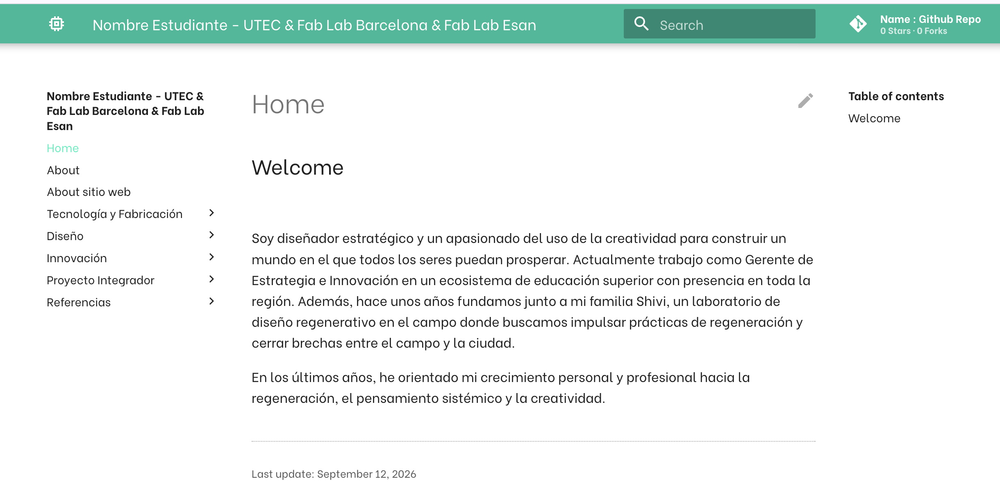
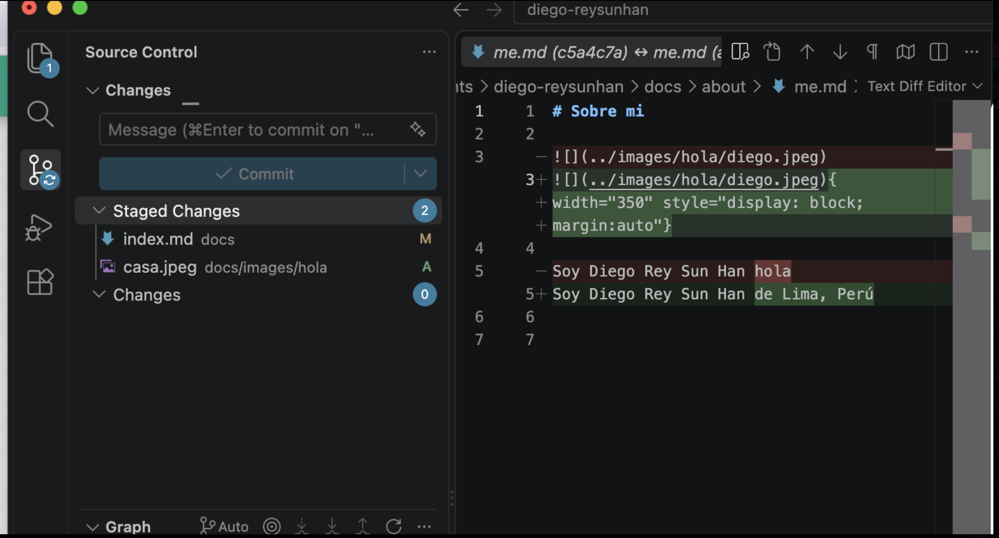

# **EFDI - MT01**

## **De dónde parto**
Empiezo esta especialización sin ninguna base en programación. Creo en los primeros años de universidad fue la única vez que hice éstas cosas. Escribo esto al inicio porque creo que es parte honesta de la documentación: lo que para otros compañeros fue un trámite de una tarde, para mí fueron varios días de prueba y error.
Esta primera etapa consistió en montar la infraestructura con la que voy a documentar todo el resto del curso: un repositorio en GitHub, un sitio web generado con MkDocs y un flujo de trabajo para publicar cambios desde mi computadora.
## **Instalación de las herramientas**
Lo primero fue instalar lo básico. Suena simple escrito así, pero fue la parte que más me costó de todo el proceso.

Las herramientas que instalé y configuré:
Git:	Guardar las versiones de mi trabajo en mi computadora
Cuenta de GitHub:	Alojar el repositorio en internet y publicar el sitio
Visual Studio Code:	El editor donde escribo los archivos
Markdown:	El lenguaje con el que escribo el contenido de las páginas
MkDocs:	Convierte mis archivos Markdown en el sitio web

## **Entender la diferencia entre Git y GitHub**
Durante los primeros días usaba las dos palabras como si fueran lo mismo. No lo son, y entender la diferencia fue el primer momento en que sentí que algo hacía clic:
•	Git es el programa que vive en mi computadora y guarda el historial de cambios. Funciona sin internet.
•	GitHub es el sitio web donde ese historial se aloja para que esté respaldado, sea público y otras personas puedan verlo.
Por eso el commit funciona sin conexión, pero el push no. Uno guarda en mi máquina, el otro envía a la nube.

El flujo de trabajo que terminé usando
Después de repetirlo muchas veces, el ciclo se me quedó grabado así:
1.	Editar el archivo .md en Visual Studio Code
2.	Stage: marcar con el signo + qué archivos quiero guardar en esta versión
3.	Escribir un mensaje que explique qué cambié
4.	Commit: guardar esa versión en mi computadora
5.	Push: subirla a GitHub, donde se publica el sitio

{ width="300" style="display: block; margin: auto" }

Lo que no estaba escrito en ningún lado, y que a mí me costó descubrir, es que el paso 3 no es opcional. Si le doy Commit sin escribir el mensaje, el programa se queda cargando indefinidamente. No es que esté fallando: está esperando a que yo escriba algo. Me pasó y estuve un buen rato pensando que se había roto.

## **Los errores que me frustraron**
Prefiero dejarlos escritos porque son la parte más real del proceso y porque probablemente los vuelva a cometer.

El commit que se queda cargando. Como conté arriba, era la caja del mensaje vacía. La solución fue escribir el mensaje antes de darle al botón.

{ width="300" style="display: block; margin: auto" }

La imagen que no se ve. Escribí lo que creía que era la instrucción correcta para insertar una foto y en la web no aparecía nada. El problema estaba en la ruta: mi archivo y mi carpeta de imágenes estaban en el mismo lugar, así que el «../» que había puesto mandaba la búsqueda a un directorio que no existía.

El detalle que más me cuesta. Aquí cada espacio, cada corchete y cada llave cuentan. Una coma de más y la página no se genera. Viniendo de un campo donde una idea mal expresada igual se entiende, acostumbrarme a que la máquina no interpreta ni perdona ha sido el cambio mental más difícil. Cuando algo no funciona, casi siempre es un carácter, no un concepto.

## **Cómo aprendí**
No lo saqué adelante solo, y creo que vale la pena decirlo:
•	Las sesiones con Mathias. Grabé las conversaciones para poder volver sobre ellas, porque en el momento asentía sin entender del todo. 
•	Volver a escuchar las clases. La segunda pasada rindió mucho más que la primera.
•	Tutoriales en video. Sobre todo para la instalación, donde ver a alguien hacerlo vale más que leerlo. Igual no funcionó porque no pude hacerlo solo. 
•	Preguntar a una IA cuando me atascaba. La usé para entender los errores, no para que hiciera el trabajo por mí. Preguntar «¿por qué falla esto?» y recibir una explicación en un lenguaje que entendía me destrabó varias veces.

## **Qué me llevo de esta etapa**
El resultado visible es pequeño: un sitio web con unas cuantas páginas. El resultado real es otro. Pasé de no saber qué era un repositorio a tener un flujo de trabajo que puedo repetir, y a entender por qué existe. Fueron más errores que aciertos, y hubo frustración de verdad, pero cada error resuelto dejó algo que ya no tengo que volver a preguntar.
Lo que sigue pendiente, y lo anoto para volver sobre ello:
•	Subir imágenes con soltura, sin tener que consultar la sintaxis cada vez
•	Entender mejor qué hace exactamente el archivo mkdocs.yml
•	Reducir el peso de las fotos antes de subirlas, para no inflar el repositorio
