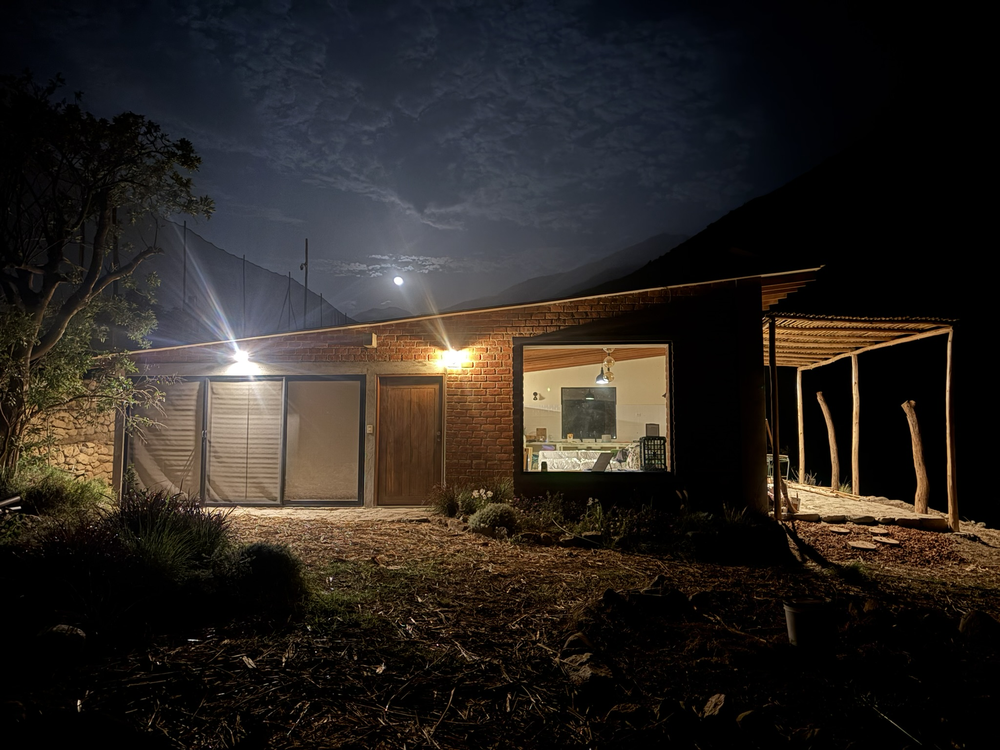

## Welcome

Soy diseñador estratégico y un apasionado del uso de la creatividad para construir un mundo en el que todos los seres puedan prosperar. Actualmente trabajo como Gerente de Estrategia e Innovación en un ecosistema de educación superior con presencia en toda la región. Además, hace unos años fundamos junto a mi familia Shivi, un laboratorio de diseño regenerativo en el campo donde buscamos impulsar prácticas de regeneración y cerrar brechas entre el campo y la ciudad.

En los últimos años, he orientado mi crecimiento personal y profesional hacia la regeneración, el pensamiento sistémico y la creatividad.

{ width="400" style="display: block; margin: auto" }